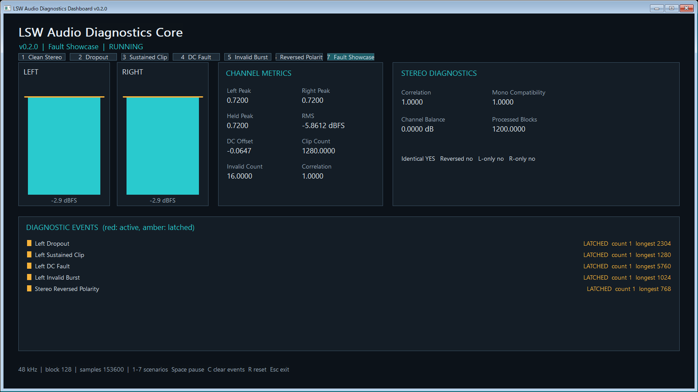

# LSW Audio Diagnostics Core

LSW Audio Diagnostics Core is a compact C++17 static library for real-time-safe mono and stereo audio diagnostics. It is designed to sit inside plug-ins, DAWs, standalone applications, and embedded audio software without taking ownership of audio I/O, UI, files, or networking.

Developed and maintained under the Liquid Signal Works name.

Version: 0.2.0



> Optional Windows dashboard example driven by deterministic synthetic signals. The core library remains platform-independent and has no third-party runtime or source dependencies.

## Features

- Float and double processing
- Sample peak, Peak Hold with sample-time-based decay, accumulated maximum absolute sample, smoothed RMS, dBFS, and DC offset
- Clip, silence, NaN, positive/negative infinity, and denormal detection
- Stereo correlation, channel balance, identical-channel, reverse-polarity, left-only, and right-only diagnostics
- Diagnostic Events: Dropout, Sustained Clip, DC Fault, Invalid Sample Burst, and stereo fault events
- `resetLevels()`, `resetCounters()`, `clearDiagnosticFlags()`, and `clearEvents()` for focused recovery workflows
- Lock-free field-based snapshot publishing from one audio writer to one or more monitoring readers
- Core library: no third-party runtime or source dependency beyond the C++ standard library

## Build

Windows PowerShell from a Visual Studio x64 developer prompt:

```powershell
Remove-Item -Recurse -Force build -ErrorAction SilentlyContinue

cmake -S . -B build `
  -G "Visual Studio 17 2022" `
  -A x64 `
  -DLSW_AUDIO_DIAG_BUILD_TESTS=ON `
  -DLSW_AUDIO_DIAG_BUILD_EXAMPLES=ON `
  -DLSW_AUDIO_DIAG_BUILD_WINDOWS_DASHBOARD=ON `
  -DLSW_AUDIO_DIAG_ENABLE_WARNINGS_AS_ERRORS=ON

cmake --build build --config Release --clean-first
ctest --test-dir build -C Release --output-on-failure
.\build\Release\lsw_audio_diagnostics_example.exe
```

On Linux or macOS, omit the Visual Studio generator and use `-DCMAKE_BUILD_TYPE=Release`.

`LSW_AUDIO_DIAG_BUILD_WINDOWS_DASHBOARD` is OFF by default and only creates a target on Windows. The Dashboard is a Win32/GDI optional example, not part of the core library: it uses no audio device I/O, no network access, and no external assets. It drives `Analyzer<float>` with deterministic synthetic signals and is the source of the screenshot above.

## Basic use

```cpp
#include "lsw/audio_diag/analyzer.hpp"

lsw::audio_diag::Analyzer<float> analyzer;
lsw::audio_diag::AnalyzerConfig config {};
config.sampleRate = 48000.0;
config.maximumBlockSize = 128U;
config.numberOfChannels = 2U;

if (lsw::audio_diag::isSuccess(analyzer.prepare(config)))
{
    const float* channels[] { leftSamples, rightSamples };
    analyzer.process(channels, 2U, 128U);
    const lsw::audio_diag::Snapshot snapshot = analyzer.getSnapshot();
}
```

Call `prepare()` before `process()`. `process()` never modifies input buffers and is `noexcept`. It accepts bad pointers and mismatched sizes safely, records those conditions in `DiagnosticFlags`, and never allocates or locks.

## Interpretation

- `channelBalanceDb > 0.0` means left is dominant; below zero means right is dominant.
- Silence requires the smoothed RMS to stay below `silenceThresholdDbfs` for `silenceHoldSeconds`.
- The default `clipThreshold` is `1.0`; every sample for which `abs(sample) >= 1.0` increments Clip Count.
- Invalid float values and denormals are counted and replaced with zero for all analysis calculations. Snapshot numeric fields therefore remain finite.
- Event counts change only when a condition enters its active state. `latched` preserves that history until `clearEvents()` or `reset()`, while active events retain sample-based current and longest durations.
- `monoCompatibilityScore` is the heuristic `clamp((correlation + 1) * 0.5, 0, 1)`. It is not a broadcast or standards-compliance measurement.

## Compatibility

v0.2.0 preserves the v0.1 public names and source-level usage, but consumers of the static library must rebuild against v0.2.0.

See [architecture.md](docs/architecture.md), [mathematical-definitions.md](docs/mathematical-definitions.md), [realtime-safety.md](docs/realtime-safety.md), and [integration-guide.md](docs/integration-guide.md).

## CMake consumption

```cmake
find_package(LSWAudioDiagnosticsCore CONFIG REQUIRED)

target_link_libraries(MyTarget PRIVATE LSW::AudioDiagnostics)
```

## License

Copyright (c) 2026 HIROAKI KAWAKITA. Licensed under the MIT License; see [LICENSE](LICENSE).
